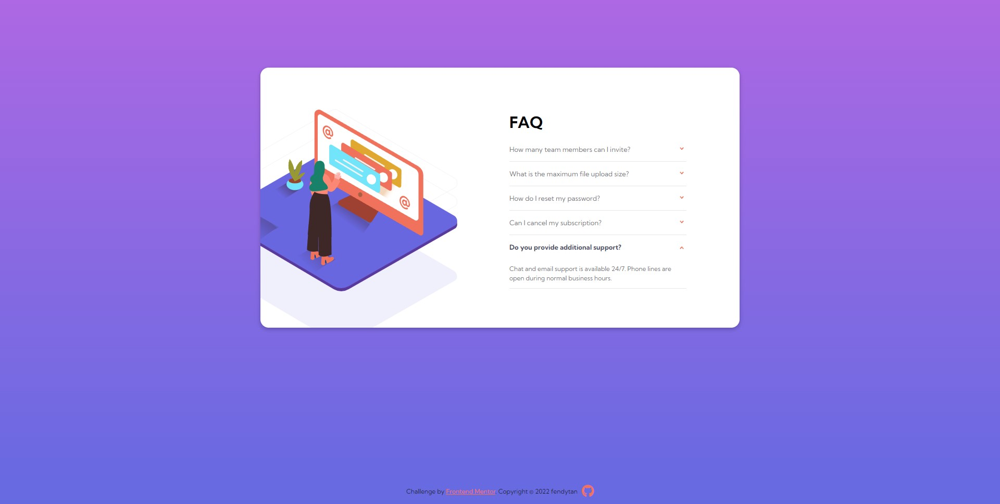

# Frontend Mentor - FAQ accordion card solution

This is a solution to the [FAQ accordion card challenge on Frontend Mentor](https://www.frontendmentor.io/challenges/faq-accordion-card-XlyjD0Oam). Frontend Mentor challenges help you improve your coding skills by building realistic projects.

## Table of contents

- [Overview](#overview)
  - [Screenshot](#screenshot)
  - [Links](#links)
- [My process](#my-process)
  - [Built with](#built-with)
  - [What I learned](#what-i-learned)
  - [Continued development](#continued-development)
- [Author](#author)

## Overview

### Screenshot

### Links

- Solution URL: [Github](https://github.com/fendytan/fm-faq-accordion-card/)
- Live Site URL: [Github Pages](https://fendytan.github.io/fm-faq-accordion-card/)

## My process

### Built with

- Semantic HTML5 markup
- CSS custom properties
- Flexbox
- Mobile-first workflow

### What I learned

This is my fifth project after completed The Odin Project's Foundation.

### Continued development

I still need more practice on CSS Flexbox and CSS grid for positioning of the elements.
I am also still having hard time in understanding position absolute and relative.
Placing background image from CSS still confuses me.

## Author

- Website - [Github](https://github.com/fendytan/)
- Frontend Mentor - [@fendytan](https://www.frontendmentor.io/profile/fendytan)
